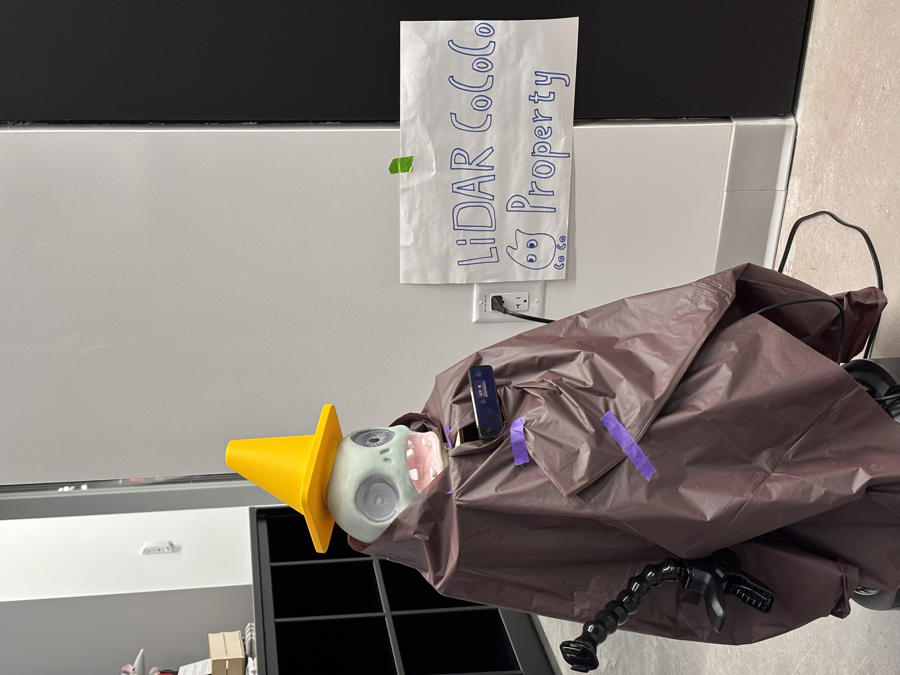

# TurtleBot4 Interactive Quiz Game (ROS2 + OAK-D)

An educational Human–Robot Interaction (HRI) quiz game using ROS2, TurtleBot4, and OAK-D RGB color detection.
Inspired by Plants vs. Zombies, the robot behaves like a “zombie” moving toward a target brain.
Students defend by answering True/False questions with 🟩green-True and 🟥red-False cards.

Correct answers slow the robot.
Wrong answers speed it up.
Students win if they reach the required number of correct answers before the robot reaches the brain.

## 🎥 Demo




[▶️ Watch the Demo](https://github.com/OHXTO/PvZ-quiz-robotic-game-HRI-Cornell-Tech/raw/main/Demo.mp4)


## Features

🎨 Color-based card detection via OAK-D RGB camera

🧠 Autonomous game controller with pre-generated audio

🔊 Fast audio playback (no live TTS)

🎲 Randomized question order

🚶 Continuous TurtleBot movement

🎯 Win/Loss conditions based on answers + robot distance

⚖️ Stability filter to avoid noisy True/False switching

## System Overview

### ROS2 Nodes
| Node                     | Description                                                   |
| ------------------------ | ------------------------------------------------------------- |
| `color_detector_node.py` | Detects green/red cards and publishes `/answer_result`        |
| `game_controller.py`     | Controls movement, scoring, audio playback, and question flow |

### Topics
| Topic                         | Type                  | Notes                            |
| ----------------------------- | --------------------- | -------------------------------- |
| `/oakd/rgb/preview/image_raw` | `sensor_msgs/Image`   | Color detection input            |
| `/answer_result`              | `std_msgs/String`     | `"True"`, `"False"`, `"Unknown"` |
| `/cmd_vel`                    | `geometry_msgs/Twist` | Robot movement                   |

## Package Structure
```
lab5/
├── launch/
│   └── game.launch.py
│
├── lab5/
│   ├── color_detector_node.py
│   ├── game_controller.py
│   ├── game_audio/
│   │   ├── ready.wav
│   │   ├── correct.wav
│   │   ├── wrong.wav
│   │   ├── win.wav
│   │   ├── lose.wav
│   │   └── q0.wav ~ q19.wav
│   └── __init__.py
│
├── package.xml
└── setup.py
```
## Running the Game

1. Build the package
```
cd ~/ros2_ws
colcon build
source install/setup.bash
```
2. Launch both nodes
```
ros2 launch lab5 game.launch.py
```
2. (Optional) run nodes separately
Color detector
```
ros2 run lab5 color_detector_node
```
Game controller
```
ros2 run lab5 game_controller
```

## Color Detection Logic

* HSV color thresholding
* Full-frame (or ROI) mask extraction
* Morphology close filter
* Largest blob area check
* Center-of-mass filtering
* **Stability filter (≈0.3s)** ensures:
  * No flickering
  * Requires consistent detection before publishing

Published result:
```
"True" / "False" / "Unknown"
```

## Audio Playback

All audio is pre-generated `.wav` files stored in `game_audio/`

Advantages:

* No TTS delay
* Consistent voice quality
* Fast playback with aplay

Used for:
* Questions
* "Correct" / "Wrong"
* "Ready"
* Win / Lose messages

## Win / Lose Conditions

Students **win** if:
They answer N correct answers (e.g., 4–7 depending on setup)

Robot **wins** if:
It reaches the target distance (tracked by odometry-like timer-based simulation), or All questions are exhausted without enough correct answers

Authors

HRI Course Project
TurtleBot4 • ROS2 Humble • OAK-D Camera
Team Members: Xingtai Huang / Xueer Zhang / Maggie Liang (Cornell Tech HRI)
